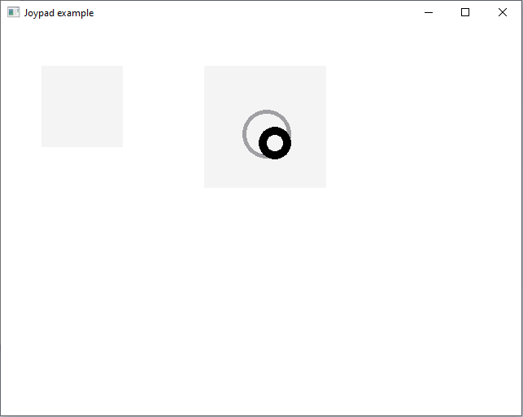
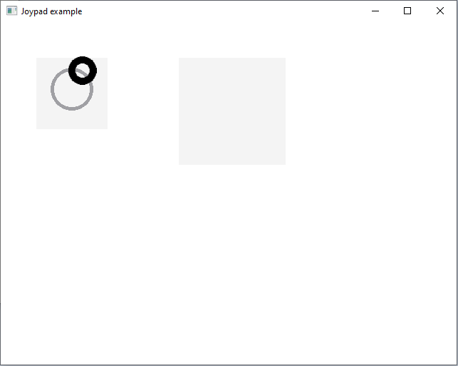

# Joypad-Qml
Joypad project for QML that supports multitouch.

## Table of Contents
* [Images](#images)
* [Technologies](#technologies)
* [Project Status](#project-status)

## Images

## Technologies
- C++
- QT Creator
- QML

## Project Status
Project is: in progress.
